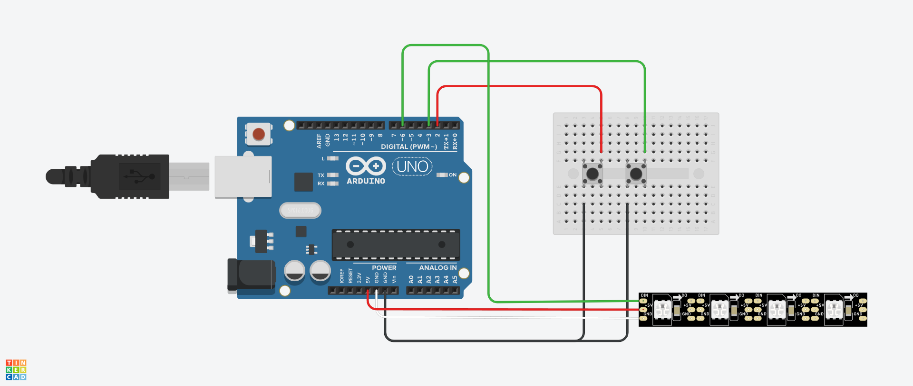
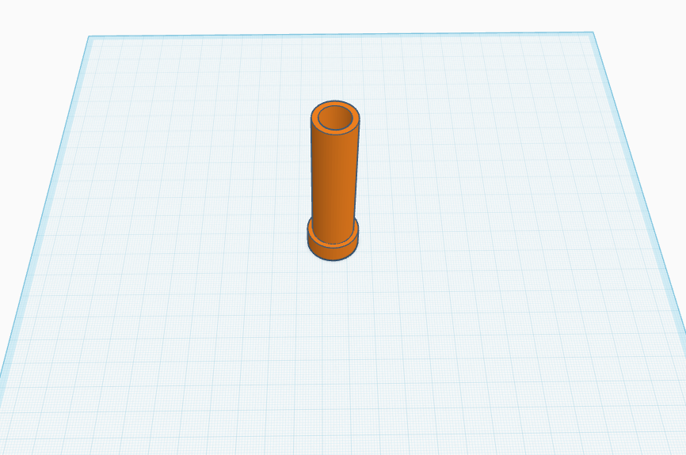
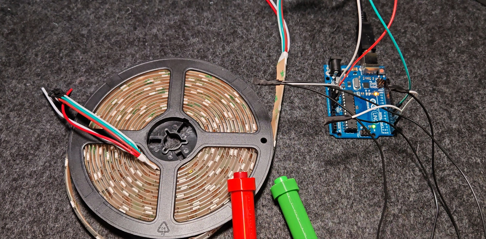
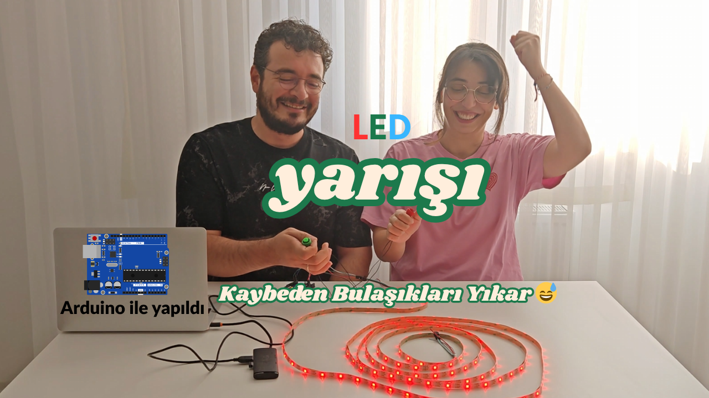

# 🏁 LED Race Game with Arduino

This is a fun 2-player reaction game built with Arduino UNO and WS2812B addressable LED strip. The first player to press their button enough times pushes their LED to the finish line — it's a race of speed and timing!

---

## 🎮 Project Summary

- 2-player LED racing game
- Uses Arduino UNO and WS2812B LED strip
- Includes custom 3D-printed button holders for better usability
- Circuit diagram, STL files, and customizable Arduino code provided

---

## 🧰 Bill of Materials

| Component                  | Quantity | Description                            |
|---------------------------|----------|----------------------------------------|
| Arduino UNO (or clone)     | 1        | Microcontroller board                  |
| WS2812B LED Strip          | 1        | 150 LEDs (5m) or shorter               |
| 12mm Push Button           | 2        | Player input buttons                   |
| 220Ω Resistor              | 1        | For LED data line (recommended)        |
| 1000uF Capacitor           | 1        | For LED power stability (recommended)  |
| Jumper Wires               | ~10      | For circuit connections                |
| 5V USB Power Bank          | 1        | Optional external power source         |
| 3D Printed Button Holders  | 2        | For easy grip and mounting             |

---

## 🧩 Wiring Diagram

  
_Circuit connections using buttons and WS2812B strip_

---

## 💾 Arduino Code

The Arduino sketch can be found here:  
📂 `arduino/led-race.ino`

You can adjust the following variables in the code:

```cpp
#define NUM_TURNS 2       // How many steps to win
#define STEP_SIZE 5       // LED increment per press
#define BRIGHTNESS 100    // LED brightness
```

---

## 🧱 3D Printed Button Holders

  
_A tube-style button holder for easier grip_

STL File:  
📦 `3d-model/button-holder.stl`

---

## 🖼️ Final Project Setup

  
_Fully assembled version of the project on the table_

---

## 📸 YouTube Thumbnail

  
_YouTube cover image used for the video_

---

## 🎬 Watch the Video

You can watch the full tutorial and demonstration on YouTube:  
🔗 **[👉 Insert YouTube Video Link Here]([https://youtube.com/your-video-link](https://youtu.be/tmdefGB0Bw8))**

---

## ⏱️ Timestamps

```
00:00 - Intro  
00:12 - Project Overview and LED Race  
02:06 - Materials  
02:41 - Assembly  
04:21 - Coding  
05:16 - Outro
```

---

## 🙌 Contribute

Feel free to fork, modify and share your version of the game!  
Pull requests are welcome, and don’t forget to ⭐ this repo if you liked the project!
